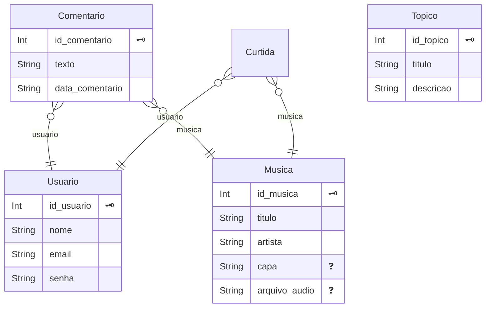

```mermaid
erDiagram

  "Usuario" {
    Int id_usuario "🗝️"
    String nome 
    String email 
    String senha 
    }
  

  "Musica" {
    Int id_musica "🗝️"
    String titulo 
    String artista 
    String capa "❓"
    String arquivo_audio "❓"
    }
  

  "Comentario" {
    Int id_comentario "🗝️"
    String texto 
    String data_comentario 
    }
  

  "Curtida" {

    }
  

  "Topico" {
    Int id_topico "🗝️"
    String titulo 
    String descricao 
    }
  
    "Comentario" }o--|| "Usuario" : "usuario"
    "Comentario" }o--|| "Musica" : "musica"
    "Curtida" }o--|| "Usuario" : "usuario"
    "Curtida" }o--|| "Musica" : "musica"
```
